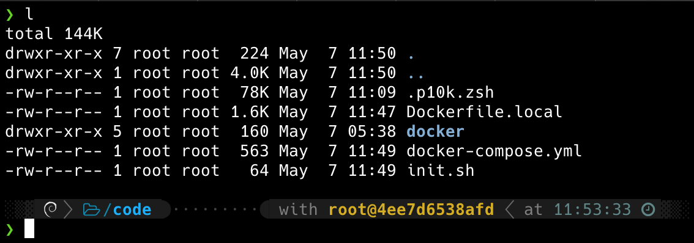

## Datascience in a container


I build a custom docker image based off [miniconda3](https://hub.docker.com/r/continuumio/miniconda3) (Debian). What you'll find:

- Dockerfile definition
- Use of docker-compose to create the service `dockermvp`
- Use of volume binds
- Zsh shell with [powerlevel10k](https://github.com/romkatv/powerlevel10k) (for fun)
- Ready to install python dependencies via `pip` (from conda) or `conda install`

## Content

```
.
├── README.md
├── docker
│   ├── conda.yml
│   └── requirements.txt
├── Dockerfile.local
├── docker-compose.yml
└── init.sh
```

**docker-compose.yml**

I define a single service with no dependencies and no external volumes in a simple docker-compose yaml file:

```yaml
version: "3.7"
services:
  dockermvp:
    image: dockermvp:local
    build:
      context: .
      dockerfile: Dockerfile.local
    container_name: docker-mvp
    entrypoint:
    ports:
    volumes:
```
[services](https://docs.docker.com/compose/compose-file/#service-configuration-reference)
[image](https://docs.docker.com/compose/compose-file/#image)
[context](https://docs.docker.com/compose/compose-file/#context)
[dockerfile](https://docs.docker.com/compose/compose-file/#dockerfile)
[entrypoint](https://docs.docker.com/compose/compose-file/#entrypoint)
[ports](https://docs.docker.com/compose/compose-file/#short-syntax-1)
[volumes](https://docs.docker.com/compose/compose-file/#volumes)


**init.sh**
The entry point for `docker-compose up` (This is where you would launch a web server...)

## Try it out

Clone and cd into this repository. To build the image locally:

`docker-compose build`

To run service in the background:
`docker-compose up -d`

To launch a zsh shell in the newly created service:

`dcomp exec dockermvp zsh`

You should see something similar to this:


